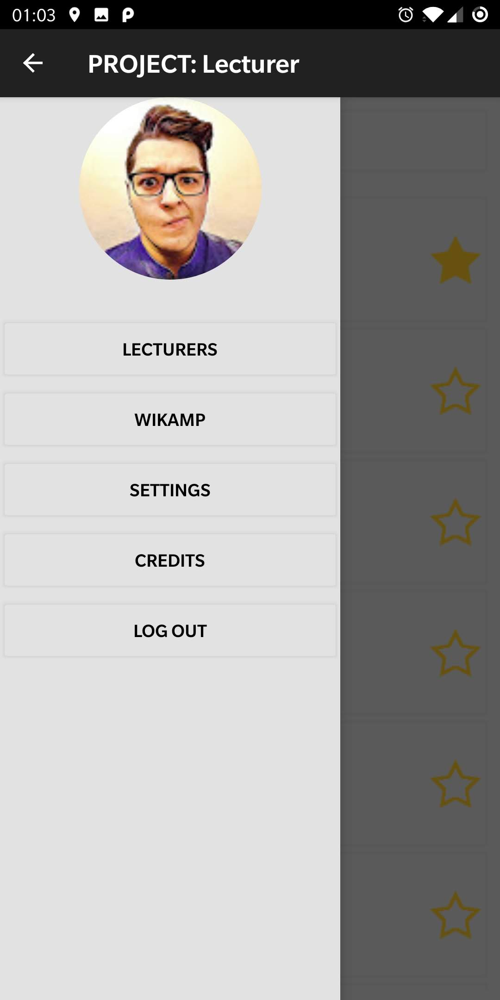

<h1> PROJECT: Lecturer </h1>

Simple application for Android that helps to find lecturers in Technical University in Lodz. Introduction to Mobile Systems (2020).<br/>

<p align="center">
  
  
  
  
</p>

<p align="center">
  
  
  
</p>

### Download
All releases of the game are avaliable on the github page in the [releases](https://github.com/msuliborski/project-lecturer/releases) tab. 
Game/App is also avaliable in [Google Play](https://play.google.com/store/apps/details?id=com.ms.projectlecturer)

## Getting Started
These instructions will get you a copy of the project up and running on your local machine for development and testing purposes. 

### Prerequisites
In order to properly build application one might need to install [Android Studio](https://developer.android.com/studio).

### Cloning
```
$ git clone https://github.com/msuliborski/project-lecturer
```

### Building
Open project in Android Studio and install all dependencies needed. Currently project is compatible with Android 10 (SDK 29).

### Usage
Simply run the application and point camera on somebody's face. Detected emotion will be desplayed under camera preview.

## Built with
* [Android Studio](https://developer.android.com/studio) - the fastest tools for building apps on every type of Android device.

## Authors
* **Michał Suliborski** - [msuliborski](https://github.com/msuliborski)
* **Michał Kuśmidrowicz** - [ninjarlz](https://github.com/ninjarlz)
* **Krzysztof Moszczyński** - [KrzysztofMoszczynski](https://github.com/KrzysztofMoszczynski)

## License
This project is licensed under the MIT License - see the [LICENSE.md](LICENSE.md) file for details
